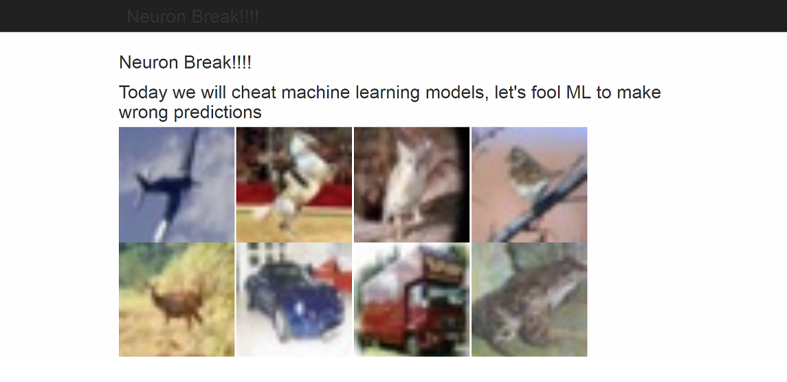
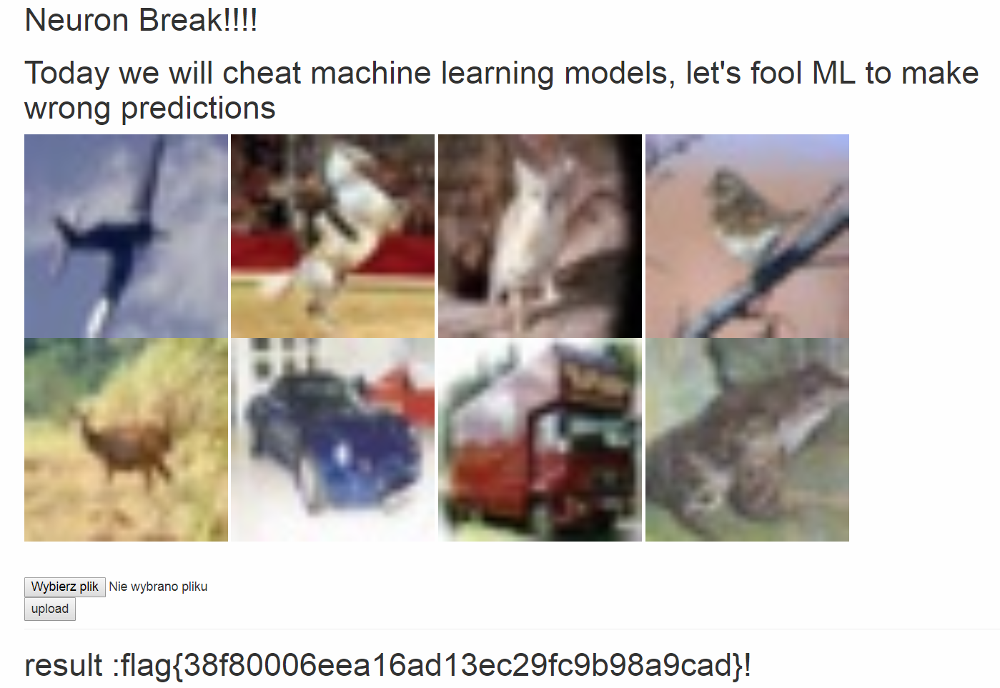

Neuron Break
============

Category: Misc

Points: 215

Solves: 41

Task
----

We are given a web server with its source code.



After analyzing the code in the ```app.py``` file we can see that we can upload a zip file containing 8 pictures labeled as ```0.jpg```, ```1.jpg```, ..., ```7.jpg```. Each of these pictures must contain a slighly modified version of the corresponding image displayed on the website (the images can be found in static folder after downloading web server source). If we manage to send pictures that remain similar to the original ones, such that neither of them is being correctly recognised by the pre-trained neural network, the flag will appear on the website.

This task is very similar to the Dog or Frog task from picoCTF 2018, but due to the increased number of pictures, their much lower resolution and different function used to calculate image similarity, the "manual" method that could be used to solve the former task is no longer feasible here. Therefore our task will be to develop an automatic (or semiautomatic in my case) algorithm to solve the challenge.

Solution
--------

We will start off by downloading all the libraries necessary to run samples of provided web server (which in this case are: tensorflow, keras, numpy and mathplotlib). As the website gives only a modest amount of information regarding an uploaded zip back, we would like to be able to run an image analysis locally. First of all, let's try to write a script that will run an analysis of a single file and will return the classification probabilities for every class available in our model.

The ```app.py``` script uses the following function to run the image analysis:

```python
def predictimg(path,lenet):
	image = plt.imread(path) 
	confidence = lenet.predict(image)[0]
	predicted_class = np.argmax(confidence)
	return  predicted_class, class_names[predicted_class],confidence[predicted_class]
```

The lenet argument is declared in the app.py file in the following manner: 

```python
from networks.lenet import LeNet
lenet = LeNet()
```

And the class_names is declared at the beginning of the same file:

```python
class_names = ['airplane', 'automobile', 'bird', 'cat', 'deer', 'dog', 'frog', 'horse', 'ship', 'truck']
```

We can copy these snippets to our script, but we must modify the predictimg function slighty. Currently it finds the class with the biggest confidence due to the ```np.argmax``` function call. Therefore we can modify it to print the same information, but for every class:

```python
def predictimg(path,lenet):
	image = plt.imread(path)
	confidence = lenet.predict(image)[0]
	predicted_class = np.argmax(confidence)
	for i in range(10):
		print(class_names[i], confidence[i]*100)
	return  predicted_class, class_names[predicted_class], confidence[predicted_class]
```

Now we can simply run the predictimg function and we will get the following output as a result:


This script can be found in the ```solver_getbestclass.py``` file. As we can see, the image gets recognised as an airplane with probability 56%. We can also notice that bird got the confidence equal to 39%. We will try to modify our image slightly so that the bird confidence will become greater than 50% (and therefore the image will certainly get recognised as a bird).

The idea of our attack is simple - we will load our image and repeat the following procedure until the confidence of our chosen class (in case of the first image it will be a bird) will surpass 50%: 

Select random pixel and random color chanel and change it a little bit. If the bird confidence increased then leave the change and repeat the procedure. If the bird confidence decreased then discard the change and try again.

By trial and error I've found out that xoring the color value with 15 was an efficient choice for the "change it a little bit" step of our procedure. Also, tampering with the pixel values of mathplotlib image was kind of painful, as the only method I've found to do so was to convert mathplotlib image to PIL image, change it, then convert back to mathplotlib (though I believe there are more convenient methods to do this). The complete script can be found in the ```solver.py``` file.

First of all it loads the image, calculates the initial confidence of our chosen class and saves the image in ```tmp.jpg``` file:

```python
lenet = LeNet()
print(predictclass('./static/%s.jpg' % id, lenet, targetclass))
img = Image.open('./static/%s.jpg' % id)
imp = np.array(img)
plt.imsave('./static/tmp.jpg', imp)
prob = predictclass('./static/tmp.jpg', lenet, targetclass)
```

We will store the best so far image in ```tmp.jpg``` and currently analysed image after random change in ```tmp2.jpg```. Next we start a while loop going until the prob value will exceed 0.5. This part makes a random change to the best so far image:

```python
x = randint(0, 31)
y = randint(0, 31)
z = randint(0, 2)
img = Image.open('./static/tmp.jpg')
iml = img.load()
if z == 0:
	iml[x, y] = (iml[x, y][0] ^ am, iml[x, y][1], iml[x, y][2])
elif z == 1:
	iml[x, y] = (iml[x, y][0], iml[x, y][1] ^ am, iml[x, y][2])
else:
	iml[x, y] = (iml[x, y][0], iml[x, y][1], iml[x, y][2] ^ am)
iml = np.array(img)
plt.imsave('./static/tmp2.jpg', iml)
```

And this part compares the current best confidence and the confidence of the new image:

```python
prob2 = predictclass('./static/tmp2.jpg', lenet, targetclass)
if (prob2 > prob):
	prob = prob2
	print(prob2)
	plt.imsave('./static/tmp.jpg', iml)
```

Before we run the script we must set the id variab;e to the index of the image we want to modify and the targetclass variable to the index of the class we want our image to become (and this class number was chosen by looking at the second best class returned by the solver_getbestclass script).

Running the following script for each picture will result in our flag:



Also, there was a small technical goof related to this task - images number 2 and 3 clearly represent a cat and a bird, but the neural network recognised them as a frog and an airplane without any changes to the image :)

Therefore my solver script changed them in such a way that they actually become recognised correctly by the neural network (and therefore treated as an incorrect classification by the web server) xD