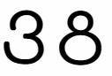

C8: Captcha
===========

Category: maths (not sure why xD)

Statement
---------

Would love to put it there, though they are no longer available on the website :C
The challenge goes like this:

You have website that gives you long math expression to calculate. Easy, just copy, paste to calculator and done.

Wrong. The font on the website is shuffled randomly, so parentheses and digits turn to some random letters (and your expression becomes something like: hhhhP z gggP r z Gzzzzwtfgggg

Hmmmm, maybe map random letters to correct digits and then solve the challenge the same way?

Wrong. The mapping of characters changes every 5 seconds.

Yay.

Solution
--------

For me, from all the challenges on Square 2018 CTF this one take the cakes. All of them. I though about jumping off the window at least several times during solving this one. Still, now I feel like this was one of the best tasks there and solving it was totally worth all the pain and agony I had to go through.

First of all, I downloaded tons and tons of python shit (and ended up using only two libraries: pytesseract and selenium). The main idea of my solution is simple: use selenium to take screenshot of webpage, use tesseract to turn expression into text, use math.eval to evaluate expression, use selenium once more to input it and submit. Simple? Wrong. Why? Just run pytesseract on the screenshot of the page and you will see why :p

Okay. But let's start from the beginning. First of all we must connect to the webpage using selenium:

```python
from selenium import webdriver

DRIVER = 'chromedriver'
driver = webdriver.Chrome(DRIVER)
driver.get('https://hidden-island-93990.squarectf.com/ea6c95c6d0ff24545cad')
```

Short and simple (you must place chromedriver.exe (and you can download it on the internet) in the same directory). Now we can take a screenshot and save it in PIL image:

```python
from PIL import Image
from io import BytesIO

screenshot = driver.get_screenshot_as_png()
im = Image.open(BytesIO(screenshot))
```

If you're not sure what BytesIO are doing here then don't worry - me neither! But fortunatelly for us, stackoverflow knows it well and we can trust him.
Now we can set up pytesseract and analyse the picture.

```python
import pytesseract

pytesseract.pytesseract.tesseract_cmd = 'C:/Program Files (x86)/Tesseract-OCR/tesseract.exe'
string = pytesseract.image_to_string(im)
```

And finally, eval:

```python
from math import *

res = eval(string)
print(res)
```

Wow! That was so easy! Let's try to run our script and see what happens! What could possibly go wrong?
```
(((((2 - 1) x ((§ x 5) + (10 x 2})) x ((10 x (10 x (§ x 10)}) - (((8+ 4) x 8) - (5 - (((6 x 9) x
 7) + 5)))) x ((@ + 2) x (8
    ^
SyntaxError: invalid syntax
```

Woah, woah, woah. There are curly brackets, "at" symbols and you can even find The Sims currency in here! Well, not cool.
But the font is pretty small. Mayve it's a good idea to zoom-in on the page. Selenium could handle this easily (well, not easily, but ask stackoverflow and the ninth thread you will find will satisfy your needs:

```python
driver.set_window_size(3000,2000) #larger the window, larger the zoom
driver.execute_script("document.body.style.zoom='450%'") #cool and good
```

```
(((((2 + (((8 - (4 + 5)) « ((? - (10 x 1)) - ((2 - 1) R
    ^
SyntaxError: invalid syntax
```

Again? What's letter R even doing here? Kind of cool, the exclamation mark in the expression fits my mood perfectly right now. But hey! Running script several times we can notice that it's always the '7' being mistaken for '?'. Same goes with 'R' - it should be multiplication sign. Hmmm 'x' and 'R', quite similar, aren't they? No wonder why did OCR recognise it incorrectly. So we can just run a couple of replaces:

```python
string = string[8:].strip().replace('x', '*').replace('{', '(').replace('}', ')').replace('§', '5').replace('«', '*').replace('Q', '9').replace('?', '7').replace('R', '*').replace('O', '9') #By the way we also remove the captcha thingy at the beginning, don't know why I haven't done it before
```

Well, looks like it works now, so let's try to submit our answer. No? Incorrect answer? Hmmm, what could go wrong. Let's analyse the expression printed out by the OCR. And here comes the part where all the joy and the will to live perish for the eternal darkness to seep into our souls:

```
Almost every 3 is being recognised as 8
```

Like, look at this dude:



What the hell man. Don't know if the use of the font was intentional or not. But what the hell. How could you do this to us (well, at least to me, other people were clever enough to play with the font file instead of tryharding to make tesseract work).

So what's the work around? The answer is simple: there is no workaround (inb4 train tesseract with new font, but why bother to do so). And by the way the 3 is not the only thing that breaks all our hopes and dreams. Tesseract still sometimes messes up the parentheses and eval will throw an exception. So here is what we will do:

```python
try:
    res = eval(string)
    print(res)
```

and this little boy at the very beginning: ```while True:```

Also copying and pasting output every time eval produces something (which probably won't work because thanks 3 and 8) will be tiring, so there comes some more selenium magic for y'all:

```python
#HTML hacker wow
driver.execute_script('document.getElementsByName("answer")[0].value = "' + str(res) + '"')
```

Basically, now if you see something interesting to pop up in the answer button, click the Submit as fast and you can and hope for something different than another "Incorrect answer.". And finally, after playing reflex test for about 15 minutes, an expression containing only one digit 3 (which somehow got recognised correctly this time) pops up.

```flag-a76013167fd4c04e3134```

👌👌👌 Thank you for your attention. Writing this writeup made me mad again.

And before somebody says that I'm bottom-hurt: nope! This was one of my best CTF adventures I've ever been on. Rolling on the floor after solving this challenge however made my back hurt a little :/


And the final script is there:
```python
from selenium import webdriver
from selenium.webdriver.common.keys import Keys 
from PIL import Image
import pytesseract
from math import *
import requests
from io import BytesIO

DRIVER = 'chromedriver'
driver = webdriver.Chrome(DRIVER)
driver.get('https://hidden-island-93990.squarectf.com/ea6c95c6d0ff24545cad')

driver.set_window_size(3000,2000)

while True:
    driver.refresh() #refresh the page
    driver.execute_script("document.body.style.zoom='450%'")
    res = 42
    driver.execute_script('document.getElementsByName("answer")[0].value = "' + str(res) + '"')
    pytesseract.pytesseract.tesseract_cmd = 'C:/Program Files (x86)/Tesseract-OCR/tesseract.exe'
    screenshot = driver.get_screenshot_as_png()
    im = Image.open(BytesIO(screenshot))
    string = pytesseract.image_to_string(im)
    string = string[8:].strip().replace('x', '*').replace('{', '(').replace('}', ')').replace('§', '5').replace('«', '*').replace('Q', '9').replace('?', '7').replace('R', '*').replace('O', '9')
    print(string)
    try:
        res = eval(string)
        print(res)
        driver.execute_script('document.getElementsByName("answer")[0].value = "' + str(res) + '"')
        s = input() #if it works, wait for an input
    except:
        2+2 #help me XD, how do I do nothing in case of an exception XD
```
