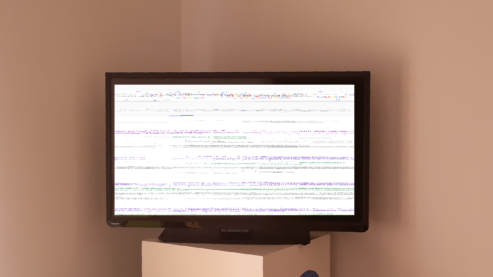
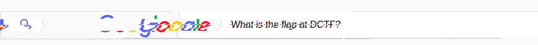
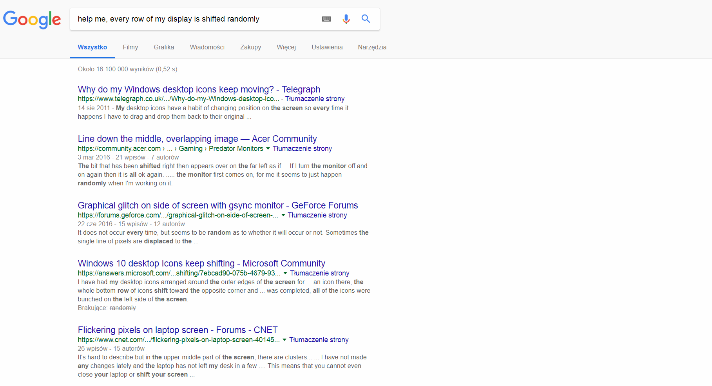
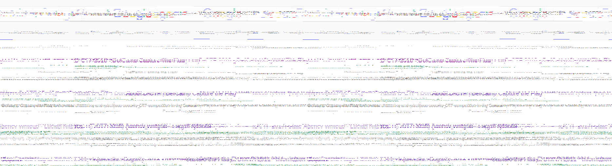
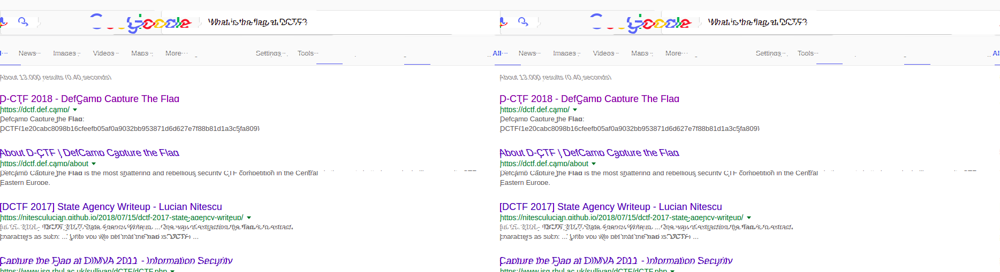

Broken TV
=========

83 points, 73 solves

Statement
---------

Guys, I've asked Google for this flag! But my only monitor is this Broken TV... 
Target: https://broken-tv.dctfq18.def.camp/ 

Solution
--------

Opening the link we can find a picture of a TV screen with some modern art displayed on it.

First of all, let's save the only interesting part of the picture in seperate file (and luckily for us, the TV screen content is in fact a poorly pasted screenshot, perfectly rectangular in shape, so copying will be hassle-free).
It kinda looks like the google search engine, but something really bad must have happened to it :C
Upon closer inspection it really looks like every single row was shifted randomly, so our task will be to "smooth out" the display.
The poor guy with the broken TV tried googling the flag so first of all we can try to see the phrase he was searching for.
Smoothing out the search bar part can be done easily manually, as the google logo stands out a lot.

"What is the flag for DCTF?" - it doesn't look very promising. Welp, I guess there is no other way and we must straighten the whole picture.
And surely doing it manually is not a good idea (at least, I'm not going to do it - feel free to spend your entire life the way you want it to be)

Hmmmm... think hard... there must be a clever way to do this... Maybe let's try googling something up for inspiration?

Woah, can you see it? Most of the page is entirely white. The white segments between the letters and words are short and the white segments surrounding the text are a little longer.
So let's put the two pictures right next to each other:

And now let's apply this simple python script:

Holy guacamole:

What did just happen here?
What the script does is simply it takes every row, finds the longest white segment and then shifts it so that it lands on the end of the picture (so our text will end on the beginning of it).
Now our picture is very smooth (well, smooth enough to read the flag and get some points) :)

Yay
